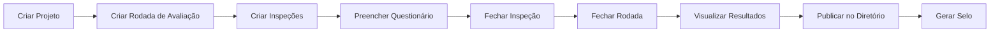
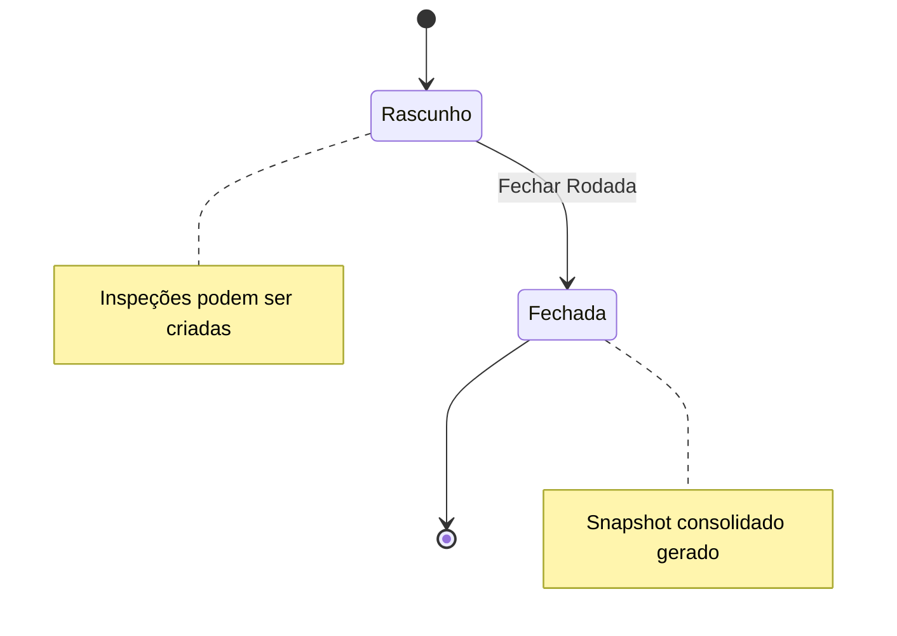
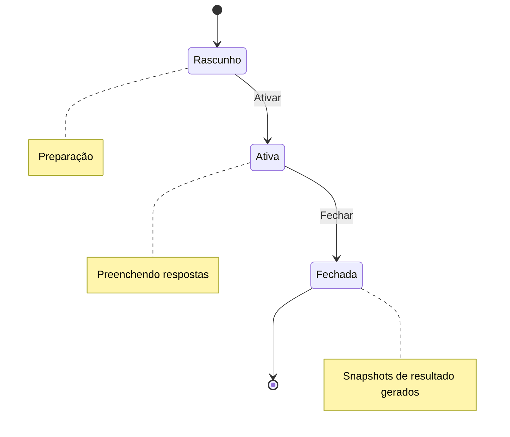
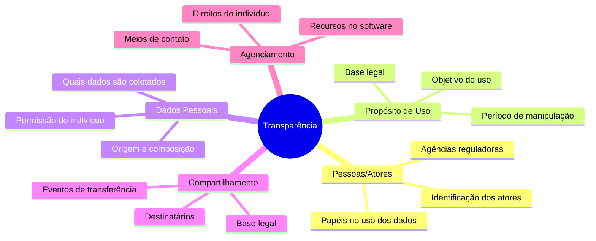
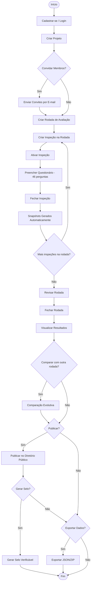

# 📘 Manual de Uso — Privacy Tool v2

**Ferramenta de Inspeção de Transparência de Dados Pessoais**

> [!NOTE]
> O Privacy Tool v2 é uma ferramenta para avaliar a transparência no uso de dados pessoais em aplicações de software, baseada na **LGPD** e no modelo acadêmico **TR-Model** (Método Mitra). A avaliação é feita através de 46 critérios distribuídos em 5 dimensões de transparência.

---

## 📑 Índice

1. [Visão Geral do Sistema](#1-visão-geral-do-sistema)
2. [Cadastro e Autenticação](#2-cadastro-e-autenticação)
3. [Workspace — Área de Trabalho](#3-workspace--área-de-trabalho)
4. [Gestão de Projetos](#4-gestão-de-projetos)
5. [Convites e Membros](#5-convites-e-membros)
6. [Rodadas de Avaliação](#6-rodadas-de-avaliação)
7. [Inspeções](#7-inspeções)
8. [Preenchimento do Questionário](#8-preenchimento-do-questionário)
9. [Resultados](#9-resultados)
10. [Comparação Evolutiva](#10-comparação-evolutiva)
11. [Diretório Público](#11-diretório-público)
12. [Selos Verificáveis (Badges)](#12-selos-verificáveis-badges)
13. [Exportação de Dados](#13-exportação-de-dados)
14. [Painel Administrativo (Filament)](#14-painel-administrativo-filament)
15. [Método Mitra — Referência Técnica](#15-método-mitra--referência-técnica)

---

## 1. Visão Geral do Sistema

O Privacy Tool v2 permite que equipes avaliem o nível de transparência de um software quanto ao tratamento de dados pessoais. O fluxo geral é:



### Papéis do Sistema

| Papel | Permissões |
|-------|-----------|
| **Dono (owner)** | Controle total do projeto: criar, editar, excluir, convidar membros, criar rodadas, publicar |
| **Avaliador (evaluator)** | Criar inspeções, preencher questionários, visualizar resultados |
| **Observador (observer)** | Apenas visualizar o projeto e seus resultados |

### Sistema de Medalhas

Os resultados são classificados por um sistema gamificado de medalhas:

| Medalha | Faixa de Score |
|---------|---------------|
| 🥇 **Ouro** | Score mais alto — excelente transparência |
| 🥈 **Prata** | Boa conformidade |
| 🥉 **Bronze** | Conformidade parcial |
| ⚠️ **Incipiente** | Score mais baixo — necessita melhorias significativas |

---

## 2. Cadastro e Autenticação

### Criar uma Conta
1. Na página inicial, clique em **"Cadastre-se"**.
2. Preencha: **Nome**, **E-mail** e **Senha** (mínimo 8 caracteres).
3. Confirme a senha e envie o formulário.
4. Você será redirecionado para a área autenticada.

### Login
1. Na página inicial, clique em **"Entrar"**.
2. Informe e-mail e senha cadastrados.
3. O sistema suporta "Lembrar de mim" e recuperação de senha por e-mail.

### Editar Perfil
- Acessível em **Perfil** no menu superior.
- Permite alterar: **Nome**, **E-mail** e **Senha**.
- Opção de **excluir a conta** permanentemente.

---

## 3. Workspace — Área de Trabalho

Ao fazer login, o **Dashboard** redireciona automaticamente para a listagem de projetos. Nesta tela você encontra:

- **Lista de projetos** em que você participa (como dono, avaliador ou observador).
- **Convites pendentes** — se alguém te convidou para um projeto, o convite aparece aqui com opção de aceitar ou recusar.
- **Botão para criar novo projeto**.

---

## 4. Gestão de Projetos

### Criar um Projeto
1. No Workspace, clique em **"Novo Projeto"**.
2. Preencha os campos:
   - **Nome** (obrigatório) — nome do software a ser avaliado.
   - **Descrição** — descrição opcional do projeto.
   - **URL** — link para o software avaliado.
   - **Ícone** — escolha um ícone visual para o projeto.
   - **Cor** — cor de destaque do projeto.
3. Clique em **Salvar**. Você será automaticamente adicionado como **dono**.

### Tela de Detalhes do Projeto

A tela de projeto exibe:
- **Informações gerais** (nome, descrição, URL).
- **Membros** — lista de todos os participantes e seus papéis.
- **Convites pendentes** — convites enviados aguardando aceitação.
- **Rodadas de Avaliação** — todas as rodadas criadas.
- **Inspeções** — lista de todas as inspeções do projeto.

### Editar e Excluir Projeto
- O **dono** pode editar os dados do projeto a qualquer momento.
- A exclusão é reversível (soft delete).

### Configurações Avançadas do Projeto
O **dono** do projeto pode acessar a aba **"Configurações"** na tela de detalhes do projeto para parametrizar o comportamento e as regras de avaliação da Mitra Tool:

1. **Requisito de Evidências**: Permite exigir obrigatoriamente que os avaliadores adicionem uma justificativa textual (observação) para qualquer resposta marcada como **"Suficiente (100 pontos)"**. Útil para auditorias rigorosas onde cada conformidade declarada deve vir acompanhada de evidências claras.
2. **Modelo de Consenso**: Define a estratégia matemática ou workflow de resolução para consolidar as respostas quando houver divergências de pontuação entre múltiplos avaliadores em uma rodada:
   - **Dono Decide**: Caso haja discordâncias, o dono do projeto revisará as notas divergentes e escolherá manualmente a resposta final consolidada na tela de revisão da rodada.
   - **Convergência dos Avaliadores**: Os avaliadores deverão discutir em um chat integrado para cada questão em conflito e reavaliar/ajustar suas próprias notas individuais até que haja convergência.
   - **Voto Majoritário**: O sistema calcula automaticamente a nota mais votada. Empates são resolvidos a favor da nota mais conservadora (menor valor).
3. **Tipo de Auditoria**:
   - **Autoavaliação (Interna)**: A própria equipe interna do software realiza a inspeção.
   - **Auditoria Externa (Independente)**: Avaliação conduzida por um auditor ou consultoria externa e independente. Essa informação gera um selo diferenciado de proveniência.
4. **Visibilidade das Avaliações**: Define se as avaliações de todos os avaliadores podem ser visualizadas a qualquer momento por outros membros ou se devem permanecer ocultas até o encerramento do preenchimento, visando evitar viés de confirmação e influência mútua (independência das avaliações).

---

## 5. Convites e Membros

### Convidar Membros
1. Na tela do projeto, na seção de membros, insira o **e-mail** do convidado.
2. Selecione o **papel**: `Avaliador` ou `Observador`.
3. Clique em **Enviar Convite**.
4. O sistema envia um e-mail com link de aceitação (válido por **7 dias**).

### Aceitar Convite
- Se o convidado **já tem conta**: ao clicar no link, é automaticamente adicionado ao projeto.
- Se o convidado **não tem conta**: o link direciona para criar uma conta com o e-mail do convite.

### Gerenciar Membros
- O **dono** pode alterar o papel de membros entre `Avaliador` e `Observador`.
- O papel de `Dono` não pode ser alterado.
- Convites podem ser **reenviados** (renova o prazo) ou **cancelados**.

---

## 6. Rodadas de Avaliação

> [!IMPORTANT]
> Rodadas de Avaliação agrupam múltiplas inspeções para gerar um resultado consolidado. É o nível principal de organização das avaliações.

### Criar Rodada
1. Na tela do projeto, clique em **"Nova Rodada de Avaliação"**.
2. Informe um **nome** descritivo (ex: "Avaliação Q1 2026").
3. A rodada é criada com status **Rascunho (draft)**.

### Ciclo de Vida da Rodada



### Fechar uma Rodada
1. Na tela da rodada, clique em **"Revisar e Fechar"**.
2. A tela de revisão exibe um **preview** do resultado consolidado (sem salvar).
3. Opcionalmente, adicione um **diagnóstico textual**.
4. Marque se deseja **publicar imediatamente** no Diretório Público.
5. Se publicar, escolha o nível de **visibilidade**:
   - **Apenas Score** — mostra apenas pontuações e medalhas.
   - **Relatório Completo** — exibe todo o detalhamento por pergunta.
6. Confirme para **fechar a rodada** e gerar o snapshot consolidado.

### Informar Versão do Software
Durante a criação ou edição da rodada, é possível registrar a **Versão do Software Avaliado** (ex: `1.0.0` ou `v2.1.3`). Isso garante que os resultados daquela rodada fiquem atrelados a um release específico do produto.

### Painel de Divergências e Resolução de Conflitos
Quando uma rodada possui mais de uma inspeção fechada por avaliadores diferentes, é comum que existam divergências de notas em certas perguntas. O sistema detecta e classifica a dispersão das notas em três níveis baseados na variância estatística das respostas:
- **Divergência Baixa**
- **Divergência Média**
- **Divergência Alta**

Durante a fase de **Revisão e Fechamento** da rodada, o **Painel de Divergências** ajuda os membros a tratarem esses conflitos dependendo do **Modelo de Consenso** ativo no projeto:
- **Sob o modelo de Dono Decide**: O dono do projeto visualizará um painel de resolução na tela de revisão, podendo clicar em cada questão em conflito e definir de forma definitiva a resposta oficial consolidada.
- **Sob o modelo de Voto Majoritário**: O sistema calcula a nota mais votada e resolve empates de forma conservadora (a menor pontuação prevalece). Não há necessidade de ação manual para fechamento.
- **Sob o modelo de Convergência**: Os avaliadores e o dono podem discutir os argumentos e evidências no **Workspace de Resolução de Conflitos** por meio de um **Chat de Discussão (Conflict Thread)** exclusivo para cada pergunta sob divergência. À medida que chegam a acordos, os avaliadores podem ajustar suas notas em suas respectivas inspeções até que o conflito seja resolvido e a rodada possa ser concluída com consenso.

---

## 7. Inspeções

### O que é uma Inspeção?
Uma inspeção representa a avaliação individual de um membro sobre o software. Cada inspeção é associada a uma **Rodada de Avaliação** e a uma **versão do questionário**.

### Criar Inspeção
1. Na tela do projeto ou da rodada, clique em **"Nova Inspeção"**.
2. Selecione a **Rodada de Avaliação** à qual a inspeção pertence.
3. A inspeção é criada com status **Rascunho (draft)**.

### Ciclo de Vida da Inspeção



| Status | Descrição |
|--------|-----------|
| **Rascunho** | Inspeção recém-criada, aguardando ativação. |
| **Ativa** | Questionário pode ser preenchido. |
| **Fechada** | Respostas congeladas; snapshots individuais e consolidados são gerados automaticamente. |

> [!WARNING]
> Apenas o **responsável** (criador) da inspeção pode alterar seu status (ativar/fechar). Uma vez fechada, a inspeção não pode ser reaberta.

---

## 8. Preenchimento do Questionário

O questionário é baseado no **Método Mitra / TR-Model** e contém **46 perguntas** organizadas em:

### Estrutura do Questionário

| Seção | Categorias (Dimensões) | Nº Perguntas |
|-------|-----------------------|-------------|
| **Existência e Qualidade da Informação** | Pessoas/Atores, Propósito de uso, Dados pessoais, Compartilhamento, Agenciamento | 26 |
| **Formato de Apresentação** | Pessoas/Atores, Propósito de uso, Dados pessoais, Compartilhamento, Agenciamento | 20 |

### As 5 Dimensões de Transparência

1. **Pessoas/Atores** — informações sobre os atores envolvidos no uso dos dados pessoais.
2. **Propósito de Uso** — objetivos, base legal e período de manipulação dos dados.
3. **Dados Pessoais** — quais dados são coletados, sua origem e composição.
4. **Compartilhamento** — políticas de transferência e compartilhamento com terceiros.
5. **Agenciamento** — meios para o indivíduo exercer seus direitos sobre os dados.

### Escala de Respostas

Cada pergunta é respondida em uma escala de 3 níveis:

| Resposta | Valor | Significado |
|----------|-------|-------------|
| **Suficiente (high)** | 100 pontos | A informação está presente e é adequada. |
| **Insuficiente (medium)** | 50 pontos | A informação existe, mas é incompleta ou inadequada. |
| **Inexistente (low)** | 0 pontos | A informação não é fornecida. |
| **Não se aplica (other)** | — | A pergunta não se aplica ao contexto atual. |

### Como Preencher
1. Acesse a inspeção (que deve estar com status **Ativa**).
2. O questionário é apresentado em **cards por seção**, organizado por categorias.
3. Para cada pergunta, selecione a resposta na escala.
4. Opcionalmente, adicione uma **observação** justificando sua escolha.
5. As respostas são salvas ao submeter.

---

## 9. Resultados

Após **fechar uma inspeção**, o sistema gera automaticamente os snapshots de resultado.

### Tipos de Resultado

#### 9.1 Resultado Individual
- Mostra o resultado da **sua avaliação pessoal**.
- Score por seção e por dimensão.
- Medalha final baseada no score global.
- Acesso: tela do projeto → inspeção → **"Ver Meus Resultados"**.

#### 9.2 Resultado da Equipe (Consolidado)
- Média consolidada de **todas as respostas** de todos os avaliadores na inspeção.
- Disponível apenas quando a inspeção está **fechada**.
- Acesso: tela do projeto → inspeção → **"Ver Resultado da Equipe"**.

#### 9.3 Resultado da Rodada
- Consolidação de **todas as inspeções** dentro de uma rodada.
- Gerado automaticamente ao **fechar a rodada**.
- Inclui: score global, medalha, scores por seção e por dimensão.
- Acesso: tela do projeto → rodada → **"Ver Resultados da Rodada"**.

### Visualização dos Resultados
- **Score numérico percentual** por seção e global.
- **Medalha** (Ouro, Prata, Bronze, Incipiente) com badge visual.
- **Gráficos** visuais por dimensão.
- Informações do projeto, versão do questionário e data.

---

## 10. Comparação Evolutiva

O sistema permite comparar resultados entre inspeções ou rodadas para acompanhar a **evolução** da transparência ao longo do tempo.

### Comparar Inspeções
- Compare os resultados consolidados de **duas inspeções** do mesmo projeto.
- Requisito: ambas as inspeções devem estar **fechadas**.
- Visualização lado-a-lado com indicadores de progresso (↑ melhoria / ↓ regressão).

### Comparar Rodadas
- Compare os resultados de **duas rodadas de avaliação** do mesmo projeto.
- Ideal para avaliar o impacto de melhorias implementadas entre rodadas.
- Requisito: ambas as rodadas devem estar **fechadas**.

---

## 11. Diretório Público

> [!TIP]
> O Diretório Público permite que qualquer pessoa (inclusive sem login) consulte o nível de transparência de softwares avaliados por esta ferramenta. É uma vitrine de conformidade.

### Publicar no Diretório
1. **Feche a rodada** de avaliação.
2. Na tela da rodada, clique em **"Publicar no Diretório Público"**.
3. Escolha o nível de visibilidade:
   - **Apenas Score** (`score_public`) — exibe scores e medalhas, sem detalhes das perguntas.
   - **Relatório Completo** (`full_public`) — exibe o relatório completo (perguntas, respostas consolidadas, scores).
4. A publicação gera um **slug** único (URL amigável) para o relatório público.

### Consultar o Diretório
- Acesse `/tools` (sem necessidade de login).
- **Filtros disponíveis**: medalha, ano, versão do questionário.
- **Ordenação**: por score (crescente/decrescente) ou por data.
- Clique em uma ferramenta para ver o relatório (sumário ou completo, conforme a visibilidade).

### Gerenciar Publicação
- O dono pode **atualizar a visibilidade** ou **remover** a publicação a qualquer momento.

### Transparência e Proveniência no Diretório Público
Ao consultar um relatório no diretório público, os visitantes poderão ver indicadores de integridade e detalhes adicionais sobre o processo de auditoria (Provenance Badge):
- **Tipo de Auditoria (Proveniência)**: Indicação clara se o resultado foi fruto de uma **Autoavaliação** interna ou de uma **Auditoria Externa**.
- **Versão do Software**: Qual versão específica do software foi auditada naquela rodada.
- **Participação**: Número total de avaliadores e de inspeções fechadas que compuseram a nota média da rodada.
- **Modelo de Consenso**: Qual modelo de resolução de divergências (Voto Majoritário, Dono Decide, Convergência) foi configurado para gerar aquele score consolidado.

> [!IMPORTANT]
> O sistema **sanitiza** automaticamente os dados públicos, removendo `user_id`, `observation` e `comments` para proteger a privacidade dos avaliadores.

---

## 12. Selos Verificáveis (Badges)

Após publicar no Diretório Público, é possível gerar um **selo embeddable** para exibir no site do software avaliado.

### Gerar Selo
1. Na tela da rodada (publicada), clique em **"Gerar Selo"**.
2. O sistema cria um selo com um **token público** único.
3. Escolha o **estilo** do selo:
   - **Default** — card completo com nome do projeto, medalha, score e data.
   - **Compact** — versão compacta com medalha e score.
   - **Minimal** — apenas medalha e score em linha.

### Incorporar o Selo
O selo pode ser incorporado em qualquer site via um script JavaScript:

```html
<script src="https://suaurl.com/badge/{TOKEN}.js"></script>
```

O script carrega automaticamente os dados atualizados via API (cache de 5 minutos) e renderiza o selo no ponto de inserção.

### Endpoints Públicos
| Endpoint | Descrição |
|----------|-----------|
| `GET /badge/{token}` | Retorna os dados do selo em JSON |
| `GET /badge/{token}.js` | Retorna o script JavaScript embeddable |

### Revogar Selo
- O dono pode revogar o selo a qualquer momento, tornando-o inativo.

---

## 13. Exportação de Dados

### Exportar Projeto
- Na tela do projeto, clique em **"Exportar Projeto"**.
- Gera um arquivo **JSON** contendo:
  - Dados do projeto e membros.
  - Todas as rodadas, inspeções e respostas.
  - Perguntas, categorias e seções correspondentes.

### Exportar Todos os Projetos
- Em **Perfil**, clique em **"Exportar Todos os Dados"**.
- Gera um arquivo **ZIP** com um JSON para cada projeto.

---

## 14. Painel Administrativo (Filament)

O sistema possui um painel administrativo acessível em `/admin` (para administradores do sistema) com recursos de gestão:

| Recurso | Descrição |
|---------|-----------|
| **Usuários** | Gerenciar contas de usuários |
| **Projetos** | Visualizar e administrar todos os projetos |
| **Inspeções** | Monitorar inspeções do sistema |
| **Convites** | Acompanhar convites enviados |
| **Versões do Questionário** | Gerenciar versões do questionário |
| **Perguntas** | Editar as perguntas do questionário |
| **Result Snapshots** | Consultar snapshots de resultados |
| **Seções** | Gerenciar seções do questionário |

---

## 15. Método Mitra — Referência Técnica

O **Método Mitra** é a base científica da ferramenta. Ele oferece um checklist estruturado para avaliar a transparência no tratamento de dados pessoais, focando em:

### Duas Seções de Avaliação

1. **Existência e Qualidade da Informação** — avalia se as informações de transparência existem e se têm qualidade suficiente.
2. **Formato de Apresentação** — avalia se as informações são apresentadas de forma acessível, objetiva e compreensível.

### Cinco Dimensões de Transparência



### Referências Oficiais
- [Metodologia TRModel (USP)](https://each.usp.br/cond_met_pand/trmodel/)
- [Portal Oficial: LGPD (Governo Federal)](https://www.gov.br/esporte/pt-br/acesso-a-informacao/lgpd)

---

## 🔄 Fluxo de Trabalho Completo

O diagrama abaixo apresenta o fluxo completo de uso do sistema, desde a criação de um projeto até a publicação dos resultados:



---

> [!TIP]
> Para melhores resultados, recomenda-se que **múltiplos avaliadores** preencham o questionário independentemente dentro da mesma rodada. O resultado consolidado (média das respostas) oferece uma visão mais confiável do nível de transparência do software avaliado.
