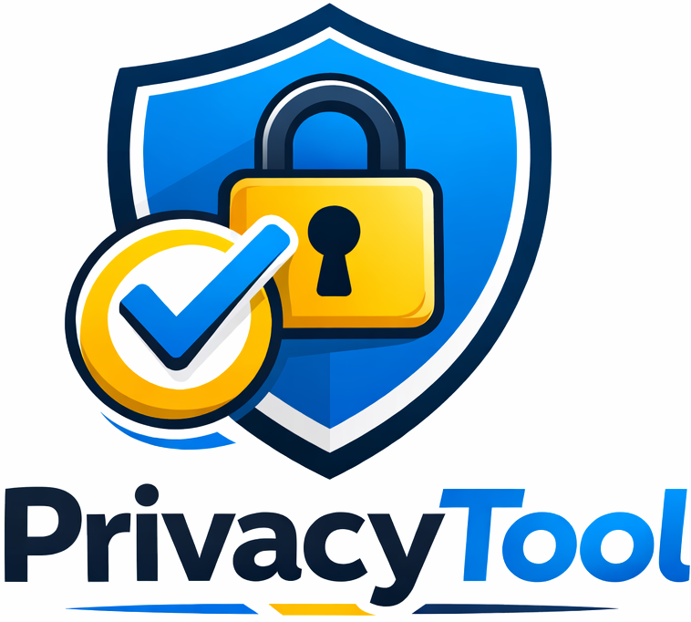

<p align="center">
  
</p>

# Privacy Tool

The **Privacy Tool** is a robust platform designed to support organizations in privacy management, compliance, and data protection. The tool centralizes the management of inspections, projects, and team collaboration within a single intuitive environment.

## 🚀 Key Features

- **Project Management**: Organize your compliance initiatives through dedicated projects.
- **Privacy Inspections**: Conduct detailed assessments based on structured questionnaires and specific categories.
- **Team Collaboration**: Invite members to your projects and manage access permissions.
- **Results and Snapshots**: Monitor compliance progress through historical snapshots and result reports.
- **Flexible Questionnaires**: Support for multiple questionnaire versions and structured sections.

## 💻 Technology Stack

- **Backend**: Laravel 12
- **Frontend**: Vue.js 3 with Inertia.js
- **Styling**: Tailwind CSS
- **Database**: MySQL / PostgreSQL / SQLite

## 🛠️ Installation and Setup

### Prerequisites

- PHP 8.2 or higher  
- Node.js & NPM  
- Composer  

### Step-by-Step

1. **Clone the repository:**
   ```bash
   git clone https://github.com/wellingtondellamura/privacy-tool2.git
   cd privacy_tool2
    ```

2. **Install PHP dependencies:**

   ```bash
   composer install
   ```

3. **Install frontend dependencies:**

   ```bash
   npm install
   ```

4. **Set up the environment:**

   ```bash
   cp .env.example .env
   php artisan key:generate
   ```

5. **Run database migrations:**

   ```bash
   php artisan migrate
   ```

6. **Start the development server:**

   ```bash
   npm run dev
   ```

## 📄 License

This project is open-source software licensed under the MIT License.
