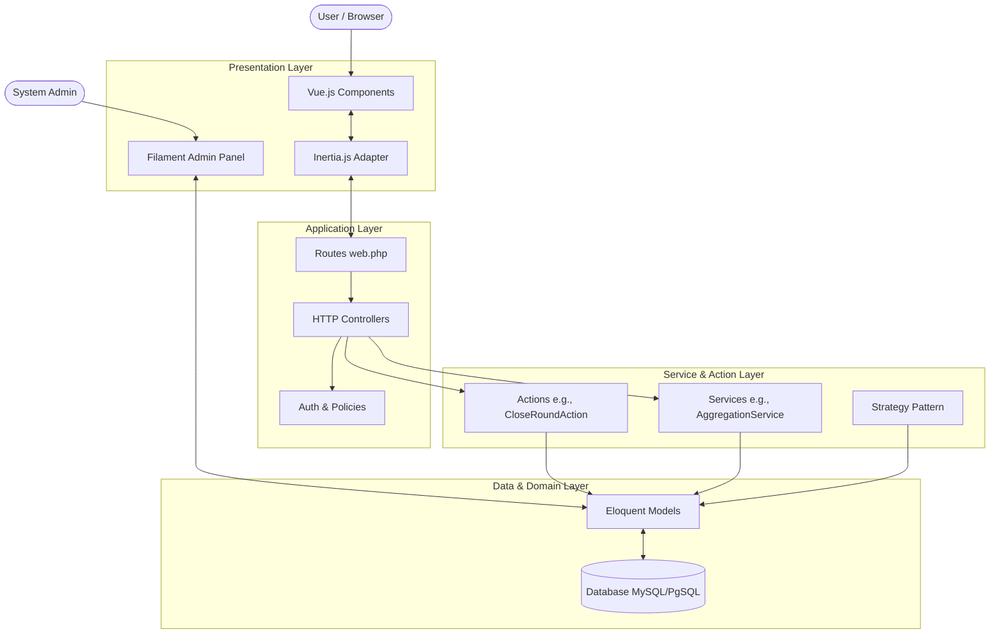

# General Architecture

The **Mitra Privacy Tool** follows a modern, modular Monolithic architecture. It builds upon Laravel's MVC (Model-View-Controller) foundation but expands it by extracting complex logic into `Services`, `Actions`, and `Strategies`.

## 1. Architectural Layers

### 1.1 Presentation Layer
Responsible for rendering the user interface and capturing user inputs. It is divided into two distinct approaches:
- **Main Application (SPA):** Uses **Vue.js 3** integrated via **Inertia.js**. Controllers return Inertia responses, passing data as props to Vue components. This provides a Single Page Application experience without the overhead of maintaining a separate API.
- **Administrative Panel:** Built with **Filament v4**. It relies on Laravel Livewire and Alpine.js to provide a robust, data-dense interface for system administrators (e.g., managing master questionnaires, users).

### 1.2 Application (HTTP) Layer
Located in `app/Http/Controllers`, this layer handles incoming HTTP requests, performs basic validation (via FormRequests), enforces authorization (via `app/Policies`), and delegates business logic to the underlying layers.

### 1.3 Service & Action Layer (Business Logic)
To prevent "fat controllers" and "fat models", the system employs specific patterns:
- **Actions (`app/Actions`):** Used for encapsulating complex, multi-step use cases that modify the state of the system. Examples include `CloseInspectionAction.php` and `CloseRoundAction.php`. These classes usually contain a single `execute` or `handle` method.
- **Services (`app/Services`):** Used for reusable domain logic, calculations, and aggregations that do not strictly orchestrate a workflow but provide essential business algorithms. Examples include `AggregationService.php`, `ComparisonService.php`, and `DivergenceService.php`.
- **Strategies (`app/Strategies`):** Indicates the use of the Strategy Design Pattern to handle varying behaviors dynamically based on contexts (e.g., scoring strategies).

### 1.4 Domain (Model) Layer
Located in `app/Models`. Utilizes Laravel's Eloquent ORM. Models represent the core entities of the business (Project, Inspection, Result, etc.). They handle data relationships, localized translations (via `spatie/laravel-translatable`), and basic data constraints.

## 2. Architectural Diagram

## 3. Key Design Patterns Utilized
- **MVC (Model-View-Controller):** The foundational pattern provided by Laravel.
- **Action Pattern:** Encapsulating use cases into single-responsibility classes (`CloseInspectionAction`).
- **Service Layer Pattern:** Extracting reusable domain logic into Services.
- **Strategy Pattern:** Abstracting algorithms into interchangeable classes (implied by `app/Strategies`).
- **Repository Pattern (Partial):** While Eloquent acts as an active record, querying complexity is sometimes abstracted away into Services or Custom Scopes.

---
**Confidence Level:** ★★★★★ (Confirmed by folder structure, routing, and specific file contents).
