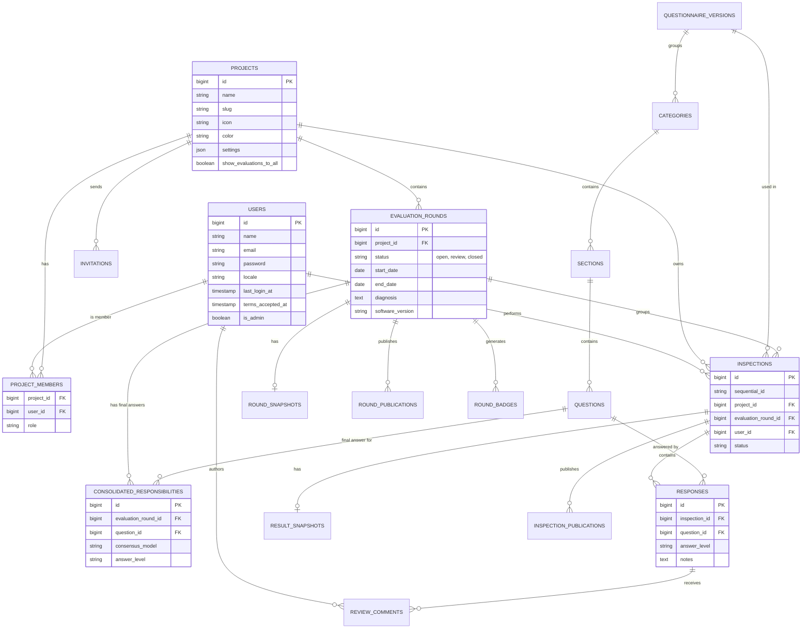

# Database Model (ERD)

This document describes the logical and physical data model of the Mitra Privacy Tool, inferred from the Eloquent Models and Laravel Database Migrations.

## 1. Entity-Relationship Diagram (ERD)

The following Mermaid diagram maps the core tables, primary relationships, and cardinalities.

## 2. Key Relationships & Constraints

### Many-to-Many Pivot Tables
- `project_members`: Connects `users` and `projects`. No auto-incrementing ID is strictly necessary, primary key is a composite of `(project_id, user_id)`. Includes a `role` column to handle permissions within the project context.

### JSON & Translatable Columns
Based on `spatie/laravel-translatable`, several tables use `json` columns to store string translations.
- For example, `questions.text`, `sections.title`, and `categories.name` are likely JSON columns formatted as `{"en": "Text", "pt_BR": "Texto"}`.
- `projects.settings` is also stored as JSON to provide schema-less flexibility for project-specific configurations.

### Soft Deletes & Timestamps
- The system heavily relies on Laravel's standard timestamps (`created_at`, `updated_at`).
- Important tables like `projects`, `users`, and `inspections` likely implement `SoftDeletes` (`deleted_at`) to ensure data is not inadvertently destroyed, preserving audit trails for compliance purposes.

---
**Confidence Level:** ★★★★★ (Derived strictly from `database/migrations` filenames and standard Laravel conventions).
